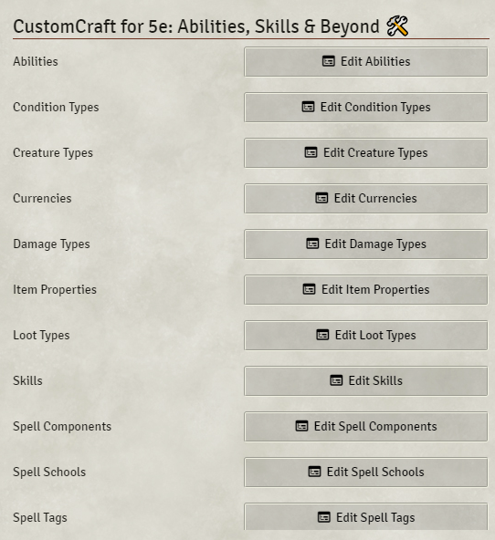
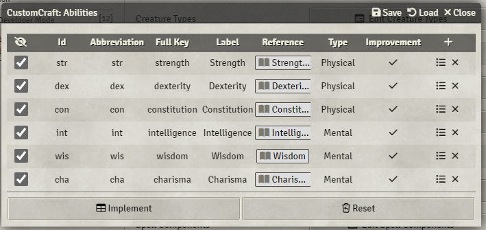
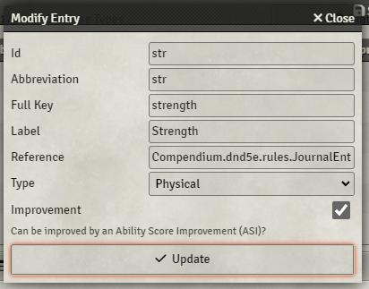

# CustomCraft for 5e: Abilities, Skills & Beyond 🛠️

## Description

Enhance your DnD5e campaigns with a module that allows Game Masters customize your DnD5e game with different abilities, skills and more! Simple yet powerful, it's perfect for creating unique, tailored gaming experiences.

## Features

-   Abilities
-   Condition Types
-   Creature Types
-   Currencies
-   Damage Types
-   Item Properties
-   Loot Types
-   Skills
-   Spell Components
-   Spell Tags
-   Spell Schools

## Installation

1. Get the manifest URL when making the purchase.
2. Open Foundry VTT, go the setup page.
3. Install the module from the provided manifest URL, using the "Install Module" application.

## Usage

1. Open your Foundry VTT game.
2. Enable the module in the Active Modules application.
3. Configure the module in the module's settings.
4. Restart the page and the new configurations should be active!

## Support

If you encounter any issues or have any questions, please feel free to reach out to us on the [module's GitHub repository](https://github.com/elizeuangelo/fvtt-module-dnd5e-customcraft-faq/issues). We'll be happy to assist you.

## Contributing

We welcome contributions from the community! If you have any ideas, bug fixes, or feature requests, please submit them as issues or pull requests on the [module's GitHub repository](https://github.com/elizeuangelo/fvtt-module-dnd5e-customcraft-faq).
